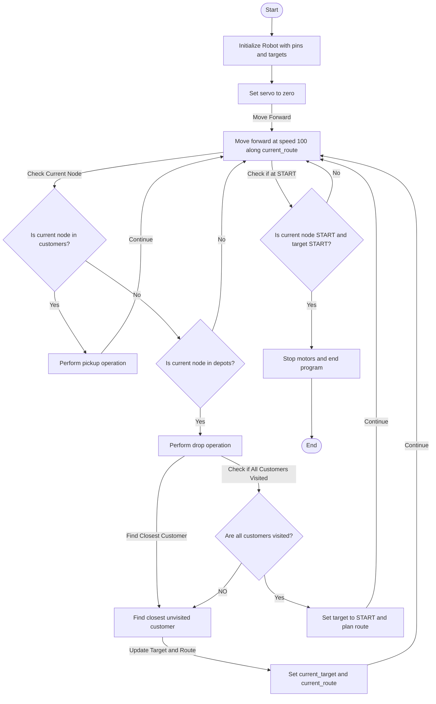

# Team L205 IDP Software Documentation

  


## Table of Contents

1. [Structure and Algorithms](#Structureandapplication)
2. [Modules](#modules)

## Structure and Algorithms
The general approach of the software structure was to create an AGV class (`Robot()`) that could be used to access motor control, sensor readings, and storing of current state variables associated to what the robot's current task is. The AGV class would respond to changes in its current route and move from node to node accordingly. The `current_node` state variable is updated to the next node in the current route whenever a junction is detected. At each detected junction a decision function is called to determine whether the robot should turn, and the `current_direction` variable is adjusted accordingly.
<div align="center">
  
  <p><em>Figure 1: Graph of town with `node_id` and edge values used by `pathfinder.py`</em></p>
</div>
The main loop (in `main.py`) starts by initialising the robot with the current target of `A`. Once the robot navigates to its target, it enters the pickup routine and initializes a new route based on the colour of the package it picked up. The route is then navigated, the block is dropped and a new route is initialized to the closest non-visited customer. The process is repeated until all customers have been visited. The robot then returns to the start box.


<div align="center">
<p><em>Figure 2: Diagram of main loop</em></p>
</div>div>

## Modules
- [robot.py](#robot.py)
- [pathfinder.py](#pathfinder.py)
- [Sensors](#sensors)
- [motors.py](#motors.py)

### `robot.py`

**Description:** Contains `Robot(i2c_bus, pins[dict], start, target1)` class. `Robot()` contains methods for AGV control for manouvring and collecting/depositing loads. Class is initialised with i2c pins and pin numbers associated with the servos, motors and sensors and can be easily modified as a modular system (eg. if sensor or servo additions are made). `start` and `target1` (in `node_id` form) are necessary to set the first route the `Robot()` should follow.

**Methods:**
- <a id="forward"></a> `forward()`: Drives robot motors at desired speed with line following and junction decision logic. Uses PID control for straight line following from [`follow_line()`](#follow_line).

- <a id="turn"></a> `turn()`: Following a call to [`junction_decision()`](#junction_decision), the robot performs a 90 degree turn in the direction set by `junction_decision()`, provided that junction type also satisfies the turn. The current state variables are then updated. This checks that the middle sensor (on the side opposite to that of the direction of tha turn) is on the line and then exits the function, such that the PID control in `forward()` is reinitiated. Boolean `with_prep = True` determines if a turning prep-time should be added. During this prep-time the robot continues forward for a set time interval before turning. `with_prep` should be turned false if turning from a reverse position.

- <a id="junction_decision"></a> `junction_decision()`: Using a 2D vector product between the current and next direction, the function returns a value that when positive indicates a left turn, when negative, a right turn, and when zero straight. If the `Robot()` is at the end of the `current_route`, the robot stops.

- <a id="detect_junction"></a> `detect_junction()`: Uses the two outer line sensors to detect junctions. If a junction is detected [`junction_decision()`](#junction_decision) is called and the position of `current_node`(graphical representation of position) is updated in [`forward()`](#forward).

- <a id="follow_line"></a> `follow_line()`: Implements PID control with two line sensor inputs straddling the line to follow the line. PID weights can be adjusted in `self.kp`, `self.ki`, and `self.kd`.

- <a id="spin"></a> `spin()`: Performs a spin by 180 degrees. This will check that the configuration of the robot has now been realligned also (to an approximate degree) before the `follow_line()` takes over again.

- <a id="pickup"></a> `pickup()`: Routine actuates the servo to pick up the block. The colour of the block is identified and the according depot is assigned as the `self.current_target`, creating a new route for `Robot()` to follow in forward. The `Robot()` will turn out of the customer zone accordingly.

- <a id="drop"></a> `drop()`: Actuates the servo to drop the block. Then the next closest customer is determined for `Robot()`. The `Robot()` turns out of the depot, facing away from the wall to avoid collision, and then exits the routine. 

### `pathfinder.py`

**Description:** Makes use of adjacency table of graph and Dijkstra's algorithm to find the minimal distance path from a given `start` node to `end` node. Includes a map from each node to their coordinate in physical space, which is used to determine which direction turns need to be made in.

**Functions:**
- `dijkstra(adj_list, start, end)`: Applies dijkstra's algorithm between `start` and `end` nodes (in `node_id` form) when prodived with `adj_list` of the underlying graph (map) and returns a tuple containing the list of the coordinates of nodes in a route (not including `start`) and the total length of the route.

- `convert_coord_to_node(coord)`: Uses the `coord_to_node` dictionary to convert phyical coordinates of nodes to their respective `node_id`.

### `motors.py`
**Description:** Includes two class definitions that are used primarily in the `robot.py`, that controls the motor movements as well as servo movements. 

#### `Motor(dir_pin, pwm_pin)`
Takes parameters of the pins used, and has the following methods:
- `self.forward(speed)`
- `self.reverse(speed)`
- `self.stop()`


#### `Servo(pwn_pin)`
Takes parameters of the pin (singular) used. It has the following methods:
- `set_angle(angle)`
- `zero()`

  
### Sensors
**File:** `tcs34725.py`
**Description:**  Includes the class TCS34725, which contains methods for initialising the colour sensor as well as reading the colour temperature, which is used in [`pickup()`](#pickup) to identify the colour of the block that has been picked up. 

**File:** `vl53l0x.py`
**Description:** Includes the class for the ToF sensor, which is not used but could be implemented in the `Robot()` class.


## License

```
MIT License

Copyright (c) 2024 

Permission is hereby granted, free of charge, to any person obtaining a copy
of this software and associated documentation files (the "Software"), to deal
in the Software without restriction, including without limitation the rights
to use, copy, modify, merge, publish, distribute, sublicense, and/or sell
copies of the Software, and to permit persons to whom the Software is
furnished to do so, subject to the following conditions:

The above copyright notice and this permission notice shall be included in all
copies or substantial portions of the Software.

THE SOFTWARE IS PROVIDED "AS IS", WITHOUT WARRANTY OF ANY KIND, EXPRESS OR
IMPLIED, INCLUDING BUT NOT LIMITED TO THE WARRANTIES OF MERCHANTABILITY,
FITNESS FOR A PARTICULAR PURPOSE AND NONINFRINGEMENT. IN NO EVENT SHALL THE
AUTHORS OR COPYRIGHT HOLDERS BE LIABLE FOR ANY CLAIM, DAMAGES OR OTHER
LIABILITY, WHETHER IN AN ACTION OF CONTRACT, TORT OR OTHERWISE, ARISING FROM,
OUT OF OR IN CONNECTION WITH THE SOFTWARE OR THE USE OR OTHER DEALINGS IN THE
SOFTWARE.
```

---
